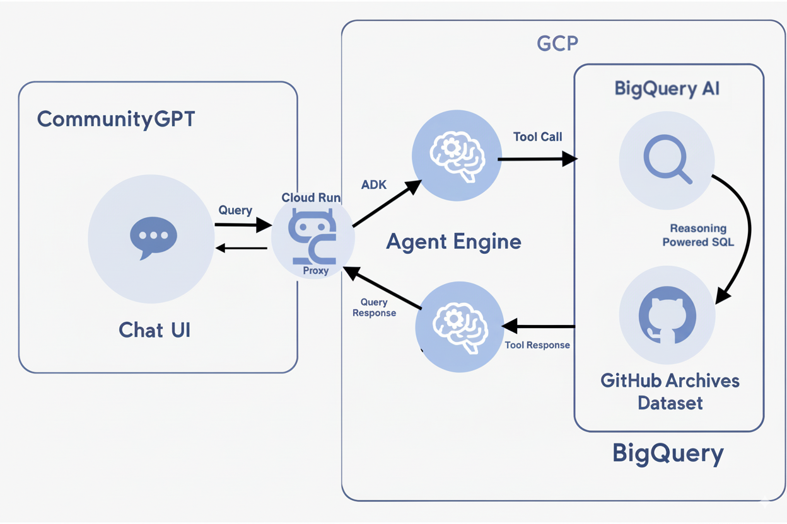

# CommunityGPT Hackathon Bundle

This bundle contains the pieces you need for the hackathon demo: a trimmed Next.js frontend that hosts the CommunityGPT chat experience and the agent stack that powers responses.

## Structure

```
hackathon-bundle/
├── frontend/   # Next.js app with chat UI + API routes
└── agents/     # Agent engine, proxy, deploy scripts, READMEs
```

## Getting started

1. **Frontend**
   ```bash
   cd frontend
   npm install
   cp .env.example .env.local   # then fill in your keys
   npm run dev
   ```
   The chat page lives at `/` and forwards requests to `/api/chat`.

## Agent

Read `agents/README.start-here.md` and check `deploy_all.sh`. Following this path will let you deploy everything at once. 
You can also deploy agent engine and agent proxy separately by following the path below.

1. **Agent engine**
   cd agents
   pip install -r requirements.txt
    `agents/README.agent-engine.md` 
   follow proxy readme to deploy agent.

2. **Agent proxy**
   ```bash
   cd agents/proxy
   pip install -r requirements.txt
   follow proxy readme to deploy cloud run
   ```
   Update the environment variables in the frontend so it can talk to the proxy. (AGENT_PROXY_URL)

The CommunityGPT frontend calls the Cloud Run proxy, which then forwards requests to the Vertex AI Agent Engine deployment.

CommunityGPT preserves conversation state within a session, so follow-up questions build on earlier context.

## Tests
Want to sanity-check the agent without wiring up the engine/proxy locally? Launch ADK Web, which talks to the same agent but uses the Google ADK Web UI instead of the CommunityGPT frontend.

## Architecture
CommunityGPT uses a two-level AI architecture that combines the Vertex AI Agent Development Kit (ADK) with BigQuery's built-in AI SQL functions.



Level 1 – Agent reasoning (outside SQL): The ADK agent interprets the user's natural language query, plans which tools to call, and generates valid SQL. It manages session memory, reuses engineered tables, applies guardrails to control cost, and orchestrates multi-step tasks across prompts. This level provides reasoning, orchestration, and reliability outside the database.

Level 2 – AI execution (inside SQL): The SQL produced by the agent is run directly in BigQuery. Here, the new AI functions (e.g., AI.GENERATE_TEXT, AI.FORECAST) handle summarization, time-series forecasting, and text generation directly against large datasets. By keeping ML operations inside BigQuery, we minimize data movement, ensure scalability, and make outputs easy to evaluate.

Together, these two layers transform BigQuery AI from a set of scattered functions into a coherent conversational analytics system.
